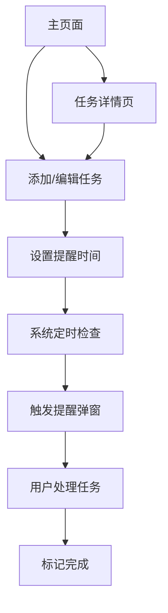

## 1. 产品概述
重要事务记录与闹钟提醒网站，帮助用户高效管理关键任务和时间安排。通过优雅直观的界面设计，让用户能够轻松记录、追踪和提醒重要事务，提升工作效率和生活质量。

## 2. 核心功能

### 2.1 用户角色
| 角色 | 注册方式 | 核心权限 |
|------|----------|----------|
| 个人用户 | 本地存储，无需注册 | 完整使用所有功能，数据本地保存 |

### 2.2 功能模块
本网站包含以下核心页面：
1. **主页面**：任务列表展示、快速添加任务、今日概览
2. **任务详情页**：任务编辑、优先级设置、提醒配置
3. **提醒中心**：闹钟提醒弹窗、历史提醒记录

### 2.3 页面详情
| 页面名称 | 模块名称 | 功能描述 |
|-----------|-------------|---------------------|
| 主页面 | 任务列表 | 展示所有任务，支持按优先级和时间排序，显示任务状态 |
| 主页面 | 快速添加 | 输入任务标题、描述、截止时间，一键创建新任务 |
| 主页面 | 今日概览 | 显示今日待完成任务数量和紧急任务提醒 |
| 主页面 | 搜索筛选 | 按关键词搜索任务，按优先级和状态筛选任务 |
| 任务详情页 | 任务编辑 | 修改任务标题、描述、截止时间、优先级 |
| 任务详情页 | 优先级设置 | 选择高/中/低三个优先级，用不同颜色标识 |
| 任务详情页 | 提醒配置 | 设置单次或重复提醒，选择提醒方式（弹窗/声音） |
| 任务详情页 | 状态管理 | 标记任务为待办/进行中/已完成状态 |
| 提醒中心 | 闹钟弹窗 | 定时弹出提醒窗口，显示任务详情和操作选项 |
| 提醒中心 | 提醒历史 | 查看已触发提醒的历史记录和完成状态 |

## 3. 核心流程
用户使用流程：
1. 用户打开网站，查看主页面任务列表
2. 点击"添加任务"按钮，输入任务信息并设置提醒
3. 系统自动在设定时间弹出提醒
4. 用户可在任务详情页修改或完成任务
5. 完成的任务移至已完成列表

## 4. 用户界面设计

### 4.1 设计风格
- **主色调**：宁静蓝色 (#4A90E2) 和白色 (#FFFFFF)
- **点缀色**：玫瑰石英色 (#F7CAC9)
- **按钮样式**：圆角矩形，悬停效果，主要操作用蓝色，次要操作用白色边框
- **字体**：系统默认字体，标题18-24px，正文14-16px
- **布局风格**：卡片式布局，顶部导航栏，左侧边栏用于分类筛选
- **图标风格**：简约线性图标，与整体色调协调

### 4.2 页面设计概述
| 页面名称 | 模块名称 | UI元素 |
|-----------|-------------|-------------|
| 主页面 | 任务卡片 | 白色卡片背景，蓝色边框表示高优先级，玫瑰石英色标签显示分类 |
| 主页面 | 添加按钮 | 圆形蓝色悬浮按钮，居中显示"+"图标，点击展开输入表单 |
| 主页面 | 顶部导航 | 蓝色渐变背景，白色文字，包含搜索框和筛选按钮 |
| 任务详情页 | 编辑表单 | 白色卡片容器，蓝色标题栏，输入框带有轻微阴影效果 |
| 任务详情页 | 优先级选择 | 三个圆形按钮，分别用深蓝/中蓝/浅蓝表示高/中/低优先级 |
| 提醒中心 | 弹窗提醒 | 白色背景，蓝色标题栏，玫瑰石英色按钮，包含任务详情和操作选项 |

### 4.3 响应式设计
- 桌面端优先设计，支持1920x1080、1366x768等常见分辨率
- 平板端自适应，保持核心功能完整
- 移动端优化布局，采用底部导航栏，任务卡片单列显示
- 触摸交互优化，按钮大小适配触摸操作

### 4.4 动效设计
- 任务卡片添加/删除时的淡入淡出效果
- 优先级切换时的颜色渐变过渡
- 提醒弹窗的弹性弹出动画
- 按钮悬停时的轻微缩放效果