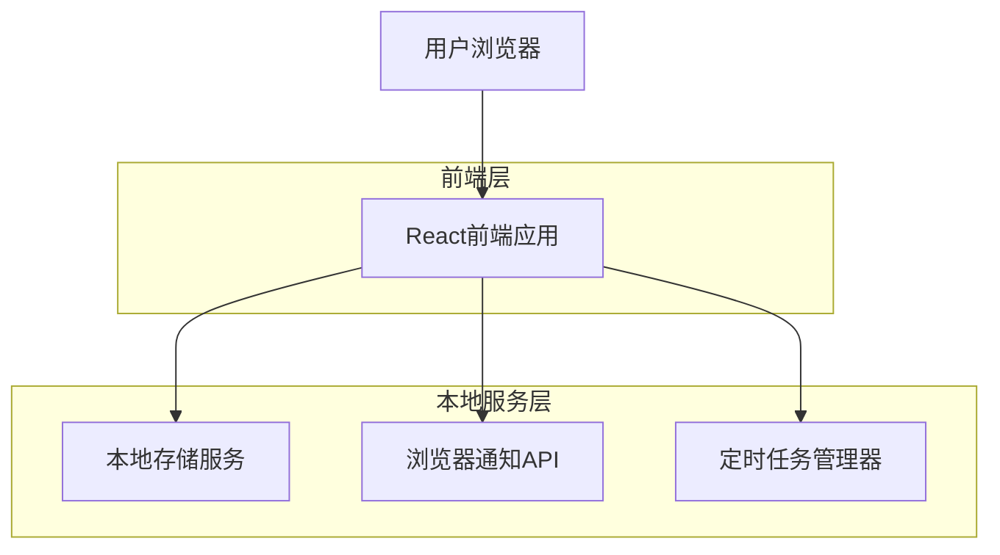
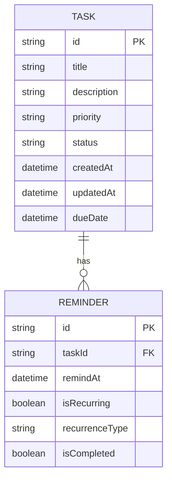

## 1. 架构设计



## 2. 技术描述

- **前端**: React@18 + TypeScript + TailwindCSS@3 + Vite
- **初始化工具**: vite-init
- **状态管理**: React Hooks + Context API
- **本地存储**: LocalStorage + IndexedDB
- **定时提醒**: Web Workers + 浏览器通知API
- **UI组件库**: HeadlessUI + 自定义组件
- **图标**: Lucide React

## 3. 路由定义

| 路由 | 用途 |
|-------|---------|
| / | 主页面，显示任务列表和概览 |
| /task/:id | 任务详情页，编辑和管理特定任务 |
| /reminders | 提醒中心，查看和管理所有提醒 |
| /completed | 已完成任务页面，查看历史完成任务 |

## 4. 数据模型

### 4.1 数据模型定义



### 4.2 数据定义语言

任务表结构 (tasks)
```typescript
interface Task {
  id: string;
  title: string;
  description: string;
  priority: 'high' | 'medium' | 'low';
  status: 'pending' | 'in-progress' | 'completed';
  createdAt: Date;
  updatedAt: Date;
  dueDate: Date | null;
  completedAt: Date | null;
}
```

提醒表结构 (reminders)
```typescript
interface Reminder {
  id: string;
  taskId: string;
  remindAt: Date;
  isRecurring: boolean;
  recurrenceType: 'daily' | 'weekly' | 'monthly' | null;
  isCompleted: boolean;
  completedAt: Date | null;
}
```

### 4.3 本地存储实现

```typescript
// 存储服务类
class LocalStorageService {
  private readonly TASKS_KEY = 'important_tasks';
  private readonly REMINDERS_KEY = 'important_reminders';
  
  // 获取所有任务
  getTasks(): Task[] {
    const data = localStorage.getItem(this.TASKS_KEY);
    return data ? JSON.parse(data) : [];
  }
  
  // 保存任务
  saveTask(task: Task): void {
    const tasks = this.getTasks();
    const existingIndex = tasks.findIndex(t => t.id === task.id);
    
    if (existingIndex >= 0) {
      tasks[existingIndex] = task;
    } else {
      tasks.push(task);
    }
    
    localStorage.setItem(this.TASKS_KEY, JSON.stringify(tasks));
  }
  
  // 删除任务
  deleteTask(taskId: string): void {
    const tasks = this.getTasks();
    const filteredTasks = tasks.filter(t => t.id !== taskId);
    localStorage.setItem(this.TASKS_KEY, JSON.stringify(filteredTasks));
  }
}
```

## 5. 定时提醒系统

### 5.1 提醒检查机制
```typescript
class ReminderService {
  private checkInterval: number = 60000; // 每分钟检查一次
  private intervalId: number | null = null;
  
  startReminderCheck(): void {
    this.intervalId = window.setInterval(() => {
      this.checkAndTriggerReminders();
    }, this.checkInterval);
  }
  
  private async checkAndTriggerReminders(): Promise<void> {
    const now = new Date();
    const reminders = this.getPendingReminders();
    
    reminders.forEach(reminder => {
      if (new Date(reminder.remindAt) <= now) {
        this.triggerReminder(reminder);
      }
    });
  }
  
  private triggerReminder(reminder: Reminder): void {
    // 显示浏览器通知
    if ('Notification' in window && Notification.permission === 'granted') {
      new Notification('重要事务提醒', {
        body: reminder.task.title,
        icon: '/icon-192x192.png'
      });
    }
    
    // 更新提醒状态
    reminder.isCompleted = true;
    reminder.completedAt = new Date();
    this.saveReminder(reminder);
  }
}
```

### 5.2 浏览器通知权限
```typescript
// 请求通知权限
async function requestNotificationPermission(): Promise<void> {
  if ('Notification' in window) {
    const permission = await Notification.requestPermission();
    if (permission === 'granted') {
      console.log('通知权限已授予');
    }
  }
}
```

## 6. 组件架构

### 6.1 核心组件结构
```
src/
├── components/
│   ├── TaskCard/          # 任务卡片组件
│   ├── TaskList/          # 任务列表组件
│   ├── TaskForm/          # 任务表单组件
│   ├── ReminderModal/     # 提醒弹窗组件
│   ├── PrioritySelector/  # 优先级选择器
│   └── Layout/            # 布局组件
├── services/
│   ├── storage.ts         # 本地存储服务
│   ├── reminder.ts        # 提醒服务
│   └── notification.ts    # 通知服务
├── hooks/
│   ├── useTasks.ts        # 任务数据钩子
│   ├── useReminders.ts    # 提醒数据钩子
│   └── useNotification.ts # 通知钩子
└── utils/
    ├── date.ts            # 日期工具函数
    └── constants.ts        # 常量定义
```

### 6.2 状态管理
```typescript
// 任务上下文
interface TaskContextType {
  tasks: Task[];
  addTask: (task: Omit<Task, 'id' | 'createdAt' | 'updatedAt'>) => void;
  updateTask: (id: string, updates: Partial<Task>) => void;
  deleteTask: (id: string) => void;
  loading: boolean;
}

// 提醒上下文
interface ReminderContextType {
  reminders: Reminder[];
  addReminder: (reminder: Omit<Reminder, 'id'>) => void;
  cancelReminder: (id: string) => void;
}
```